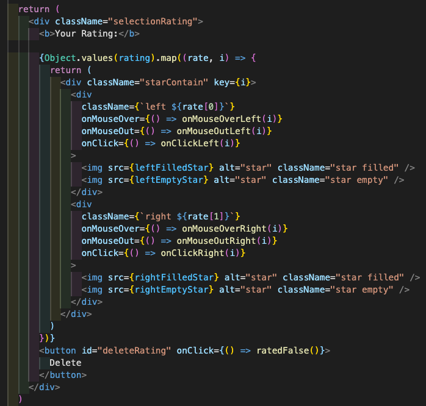

# TMDB ReThunk :film_strip::movie_camera:
### Created By: Sam'an Khaliq :thinking::thought_balloon:
(Deployed Site Below)

## Overview
****

This website was my first attempt at using React Router in conjunction with Redux and Thunk (hence the name, haha). I had a lot of fun revisiting the idea of querying the [TMDB API](https://developers.themoviedb.org/3/getting-started/introduction) for information to display. I also tried to think a little bit outside of the box on the design, opting for a scrollable side menu from which users may choose a title.

### My Favorite Code Block:

My favorite code block is the component I used to record and display user ratings ([click here](https://github.com/SamanKhaliq47/TMDB-ReThunk/blob/master/src/components/movies/Rating.js) to see the whole thing), mainly because this was a feature I just couldn't seem to nail down. I believe this was my first attempt at saving state so that a user might leave a page they'd interacted with, come back, and the state would still reflect their changes, particularly without the use of a database. I had an especially tough time finding, cropping, and styling the star images so that they looked somewhat professional. The functions in charge of the mouseover effects also challenged my patience (not to mention confidence as a software engineer, if I'm being honest).

  <a href='https://www.linkedin.com/in/saman-khaliq/' target='_blank'>LinkedIn</a> | <a href='https://www.samankhaliq.com/' target='_blank'>Portfolio
  </a> | <a href='https://tmdb-rethunk.vercel.app/'>Deployed Site</a>
  

